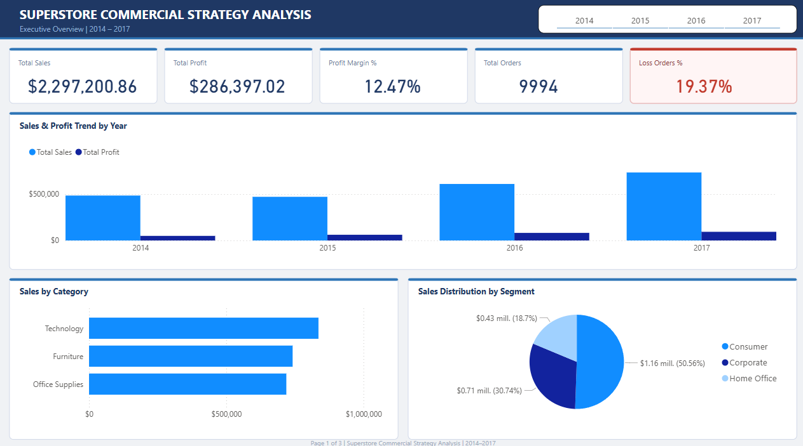
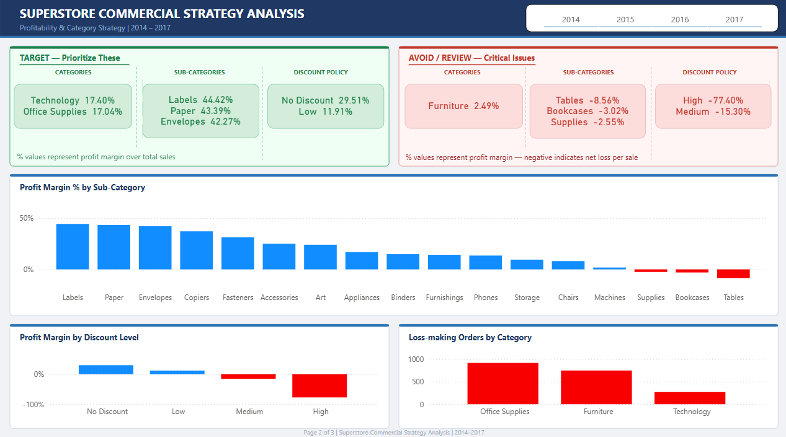
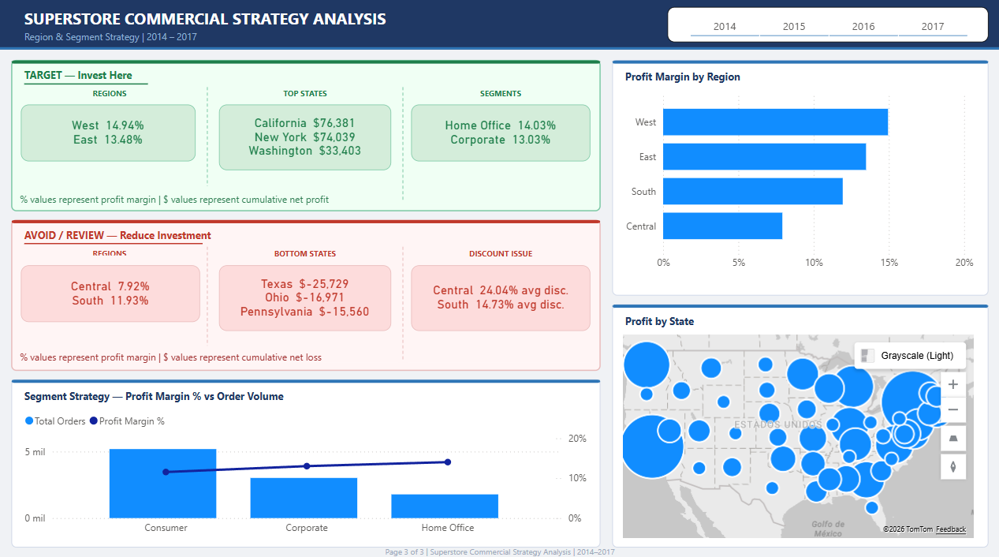

# 🛒 Superstore Commercial Strategy Analysis
### A Data Analytics Consulting Case Study


> **End-to-end analytics consulting project** for a US retail giant seeking to understand which products, regions, categories, and customer segments to target or avoid. Built to demonstrate business thinking, analytical depth, and executive communication skills.

---

## 📊 Dashboard Preview

### Executive Overview


### Category & Product Strategy


### Region & Segment Strategy


---

## 1. Introduction

### Business Context
A Superstore Giant operating across the United States requested a strategic analysis of their commercial operations covering 4 years of transaction data (2014–2017). With growing market competition and deteriorating margins in key business areas, leadership needed clarity on where to invest and where to cut.

**Stakeholder:** VP of Commercial Strategy  
**Business Question:** *"Which products, regions, categories, and customer segments should we target — and which should we avoid?"*

| Dimension | Detail |
|-----------|--------|
| Dataset | 9,994 order records |
| Period | January 2014 – December 2017 |
| Geography | United States — 49 states, 4 regions |
| Products | 3 categories, 17 sub-categories, 1,862 unique products |
| Customers | 793 unique customers, 3 segments |

### Hypotheses & Assumptions
- Profit margin is the primary success metric — revenue alone does not indicate business health
- Discount policy is a likely driver of margin erosion based on retail industry patterns
- Geographic performance differences are driven by commercial practices, not just market size
- Profit = 0 orders are classified as unprofitable — zero margin orders still consume operational resources

---

## 2. Problems

### Problem 1 — Discount Policy is Destroying Margin
The business applies discounts without a structured ceiling, resulting in severe margin erosion. Orders with discounts above 20% consistently generate losses, and the High discount tier (>40%) produces a **-77.4% profit margin** — meaning the company loses $0.77 for every dollar sold at that discount level.

**Evidence:**
| Discount Level | Orders | Avg Discount | Profit Margin |
|---------------|--------|-------------|---------------|
| No Discount | 4,798 | 0% | 29.51% ✅ |
| Low (≤20%) | 3,803 | 19.68% | 11.91% ✅ |
| Medium (≤40%) | 460 | 34.60% | -15.30% ❌ |
| High (>40%) | 933 | 70.03% | -77.40% ❌ |

High discount orders alone accumulate **-$99,558 in losses** across the 4-year period.

---

### Problem 2 — Furniture Category Operates Without Viable Margins
Despite generating $742K in revenue (2nd highest), Furniture delivers only **2.49% profit margin** — the lowest of all categories. Two of its sub-categories actively destroy value: Tables at **-8.56%** and Bookcases at **-3.02%**.

**Evidence:**
| Category | Total Sales | Total Profit | Profit Margin |
|----------|-------------|-------------|---------------|
| Technology | $836,154 | $145,456 | 17.40% ✅ |
| Office Supplies | $719,047 | $122,491 | 17.04% ✅ |
| Furniture | $742,000 | $18,451 | 2.49% ❌ |

Tables sub-category alone consumes **96% of all Furniture profit**, leaving the entire category on the verge of operating at a loss. 1 in 3 Furniture orders (33–37%) is unprofitable across all customer segments.

---

### Problem 3 — Central Region Underperforms Due to Excessive Discounting
The Central region has the lowest profit margin of all regions (7.92%) despite being the 3rd highest in revenue ($501K). Root cause analysis reveals that Central applies an average discount of **24.04%** — more than double West's 10.93% — directly correlating with its poor margin performance.

**Evidence:**
| Region | Total Sales | Profit Margin | Avg Discount |
|--------|-------------|---------------|-------------|
| West | $725,458 | 14.94% ✅ | 10.93% |
| East | $678,781 | 13.48% ✅ | 14.54% |
| South | $391,722 | 11.93% ✅ | 14.73% |
| Central | $501,240 | 7.92% ❌ | 24.04% |

Additionally, Texas alone generates **-$25,729 in losses** with $170K in sales — the worst performing state in the portfolio.

---

### Problem 4 — 19.4% of All Orders Are Unprofitable
Across the entire business, **1,936 out of 9,994 orders** (19.4%) generate zero or negative profit. This is not isolated to one area — it affects all categories and segments, indicating a systemic pricing and discount management issue rather than a localized problem.

---

## 3. Solutions

### Solution 1 — Implement a 20% Maximum Discount Policy

**Recommended Action:** Establish a hard ceiling of 20% on all discounts across all categories.

| | Pros | Cons |
|-|------|------|
| **Implement 20% cap** | Eliminates all Medium/High discount losses. Recovers up to $135K in lost margin annually. Easy to enforce operationally | May reduce order volume short-term. Sales team resistance expected |
| **Tiered approval system** | Discounts >20% require VP approval. Preserves flexibility for strategic accounts | Slower process. Risk of exceptions becoming the norm |
| **Category-specific caps** | Different ceilings per category based on margin tolerance | More complex to manage. Higher training requirements |

**Recommendation:** Implement the 20% hard cap immediately with a 30-day transition period. Track monthly profit margin as the primary success KPI.

---

### Solution 2 — Restructure the Furniture Portfolio

**Recommended Action:** Conduct a full pricing and cost review of Tables and Bookcases sub-categories.

| | Pros | Cons |
|-|------|------|
| **Reprice Tables and Bookcases** | Directly recovers margin without reducing assortment | Risk of losing price-sensitive customers |
| **Discontinue loss-making SKUs** | Eliminates guaranteed losses. Simplifies portfolio | Reduces product variety. Customer perception risk |
| **Bundle with high-margin items** | Maintains revenue while improving overall margin mix | Complex to implement. Requires marketing investment |

**Recommendation:** Reprice the top 10 loss-making products in Tables and Bookcases within 60 days. If margin does not improve to minimum 5% within 2 quarters, initiate discontinuation review.

---

### Solution 3 — Reduce Discounting in Central Region

**Recommended Action:** Align Central region's discount practices with West region standards (10–11% average).

| | Pros | Cons |
|-|------|------|
| **Enforce discount cap in Central** | Could recover ~7 margin points. Aligns with best-performing region | Local sales team may lose competitive flexibility |
| **Retrain Central sales team** | Addresses root behavior, not just symptoms | Requires time and investment. Results not immediate |
| **Restructure Central incentives** | Tie sales team bonuses to margin, not revenue | Incentive redesign is complex and time-consuming |

**Recommendation:** Implement discount cap in Central immediately. Redesign sales incentive structure to reward margin performance over the next quarter.

---

### Solution 4 — Invest in Home Office Segment Growth

**Recommended Action:** Prioritize customer acquisition and retention in the Home Office segment.

| | Pros | Cons |
|-|------|------|
| **Targeted Home Office campaigns** | Highest margin segment (14.03%). Each new customer generates more value per order | Smallest segment — growth ceiling may be limited |
| **Loyalty program for Home Office** | Average customer purchases only 1–2x per year. Program could double frequency | Investment required. ROI not immediate |
| **Maintain Consumer volume** | Largest revenue segment. Reducing focus risks revenue loss | Lower margin (11.55%). Less efficient use of resources |

**Recommendation:** Launch a dedicated Home Office acquisition campaign in West and East regions — highest margin segment in highest margin regions creates maximum ROI.

---

## 4. Conclusion

The Superstore's core profitability challenge is not a revenue problem — it is a **margin management problem**. The business grew sales by 51.4% from 2014 to 2017, and profit grew 88.6% in the same period, demonstrating that the underlying business model works. However, three structural issues are preventing the company from realizing its full profit potential:

1. **An uncontrolled discount policy** that turns profitable sales into losses — 1,393 orders with Medium or High discounts generated -$135,376 in combined losses
2. **A Furniture category operating near breakeven** — generating $742K in sales but only $18K in profit, with Tables actively destroying value at -8.56% margin
3. **A Central region applying double the discounts of the best-performing region** — resulting in a margin gap of 7 percentage points that is entirely self-inflicted

The data also reveals a significant opportunity: the Home Office segment, despite being the smallest by volume, consistently delivers the highest profit margin per order. South region shows similar characteristics — strong margin efficiency with untapped volume potential.

---

## 5. Next Steps

| Priority | Action | Owner | Timeline | Success Metric |
|----------|--------|-------|----------|----------------|
| 🔴 1 | Implement 20% maximum discount policy across all categories | VP Commercial Strategy | 30 days | Avg discount ≤ 20% — monitor monthly |
| 🔴 2 | Reprice top 10 loss-making products in Tables and Bookcases | Product & Pricing Team | 60 days | Tables margin ≥ 0% within 2 quarters |
| 🟡 3 | Enforce discount ceiling in Central region | Regional Sales Director | 30 days | Central margin improvement to ≥ 11% |
| 🟡 4 | Redesign Central sales incentives — reward margin, not revenue | HR + Commercial Strategy | 90 days | Central avg discount ≤ 15% |
| 🟢 5 | Launch Home Office acquisition campaign in West and East | Marketing Team | 90 days | Home Office orders +20% YoY |
| 🟢 6 | Implement customer loyalty program | CRM Team | 6 months | Avg purchase frequency: 5 → 8 orders/year |

---

## 🛠️ Tools & Skills Demonstrated

### Microsoft Excel — Advanced
- Data cleaning and transformation with documented cleaning log
- Mixed date format resolution using IF(ISNUMBER()) + FIND("/")
- 5 calculated business columns with documented logic
- Pivot Tables, KPI Summary dashboard, trend charts
- Data Dictionary (26 columns) and Cleaning Log (9 issues)

### SQL Server — Intermediate
- 6 analytical scripts progressing from basic aggregations to subqueries
- CASE WHEN logic for business classification
- Cross-dimensional analysis (Region × Category, Segment × Discount)
- Post-import validation and data type management
- Professional commenting, naming conventions, and documentation

### Power BI — Intermediate
- Star schema data model with Calendar table for time intelligence
- 10 DAX measures including YoY Sales Growth and CONCATENATEX dynamic cards
- 3-page executive dashboard with TARGET/AVOID strategic framework
- Custom SVG page backgrounds and synchronized slicers

---

## 📁 Project Structure

```
superstore-commercial-analysis/
│
├── 📁 data/
│   ├── raw/                        # Original unmodified dataset
│   └── cleaned/                    # Cleaned file — 26 columns, 9,994 records
│
├── 📁 sql/
│   ├── 00_table_setup_and_verification.sql
│   ├── 01_data_exploration.sql
│   ├── 02_sales_analysis.sql
│   ├── 03_profitability_analysis.sql
│   ├── 04_customer_segmentation.sql
│   ├── 05_regional_analysis.sql
│   └── 06_discount_impact.sql
│
├── 📁 excel/
│   └── superstore_analysis.xlsx    # Pivot tables + KPI dashboard + charts
│
├── 📁 powerbi/
│   └── superstore_dashboard.pbix   # 3-page executive dashboard
│
├── 📁 images/
│   ├── dashboard/                  # Power BI screenshots (3 pages)
│   └── charts/                     # Excel chart screenshots (6 charts)
│
├── 📁 documentation/
│   ├── data_dictionary.md          # 26 column definitions with business rules
│   ├── cleaning_log.md             # 9 issues identified and resolved
│   └── sql_documentation.md        # Query findings and analytical notes
│
├── README.md
└── .gitignore
```

---

## 🔄 Methodology

```
1. DISCOVERY        Business context, stakeholder definition, SMART objectives
        ↓
2. DATA CLEANING    Excel — 9 issues identified, documented, and resolved
        ↓
3. SQL ANALYSIS     6 scripts answering 7 business questions
        ↓
4. EXCEL ANALYSIS   Pivot tables, KPI summary, trend and distribution charts
        ↓
5. VISUALIZATION    Power BI 3-page executive dashboard with strategic framework
        ↓
6. DOCUMENTATION    Data dictionary, cleaning log, SQL findings, case study
```

---

## 📈 Business Questions Answered

| # | Business Question | Answered In |
|---|------------------|-------------|
| BQ-01 | Which products and sub-categories generate losses? | SQL 03 + Power BI Page 2 |
| BQ-02 | Which regions and states are most and least profitable? | SQL 05 + Power BI Page 3 |
| BQ-03 | Which customer segment is most valuable? | SQL 04 + Power BI Page 3 |
| BQ-04 | How does discount level impact profitability? | SQL 06 + Power BI Page 2 |
| BQ-05 | Which ship mode affects margins and where? | SQL 02 |
| BQ-06 | What is the sales and profit trend over time? | SQL 01 + Power BI Page 1 |
| BQ-07 | Which are the top and bottom performing products? | SQL 02 + SQL 03 |

---

## 🚀 How to Reproduce

**Excel:** Open `data/cleaned/superstore_cleaned.xlsx` → Review `CLEANING_LOG` tab → Open `excel/superstore_analysis.xlsx` for pivot tables

**SQL:** Create `SuperstoreDB` → Import `data/cleaned/superstore_cleaned.csv` → Run scripts in `/sql/` in order (00 → 06)

**Power BI:** Open `powerbi/superstore_dashboard.pbix` → Update data source path if prompted → Refresh data

---

## 👨‍💼 Author

**Orlando Gabriel Sanchez Vilchis**  
Business & International Trade | Data & BI Analyst

[](https://www.linkedin.com/in/orlando-gabriel-sanchez-vilchis)
[](https://github.com/ogsvilchis)

---

*Dataset source: [Superstore Dataset — Kaggle](https://www.kaggle.com/datasets/vivek468/superstore-dataset-final/data) | Available for educational and portfolio use.*
